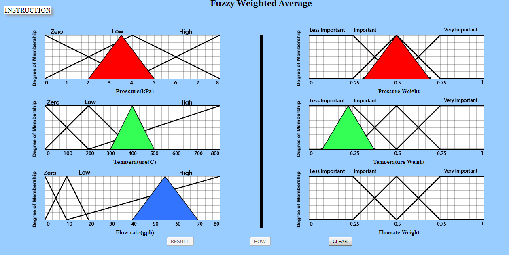

# Procedure
1. Click arbitrarily within the triangles to input Pressure.

    

   
   

2. Give the values in the input box within range to input Pressure.

    

   
   

3. Click arbitrarily within the triangles and give values to input Temperature.

    

   
   

4. Click arbitrarily within the triangles and give values to input Flowrate.

    

   
   

5. Click two points on the X-axis to input Pressure Weight.

    

   
   

6. Click two points on the X-axis to input Temperature Weight.

    

   
   

7. Click two points on the X-axis to input Flowrate Weight.

    

   
   

8. Click Result button to check what operation was performed.

    

   
   

9. Click on How button to know how the operation was performed .

    

   
   

10. Click on Clear Button and Perform the experiment again.

   
   
